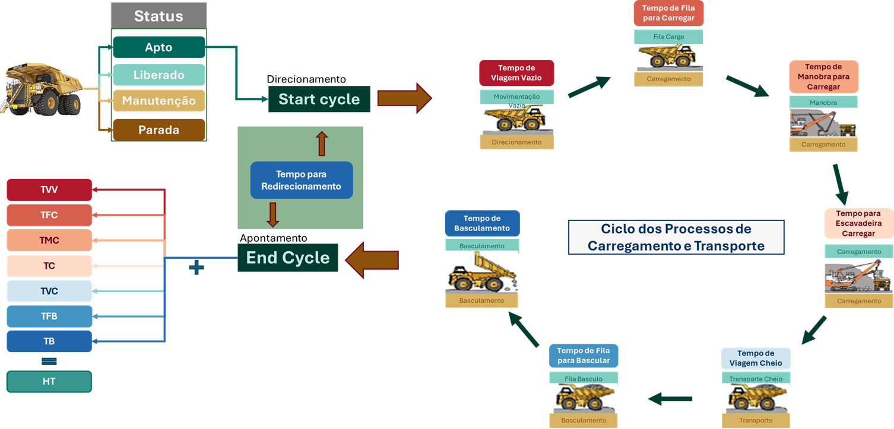
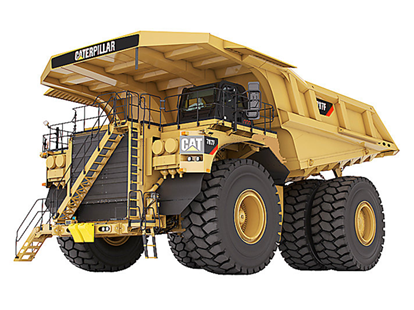

O ciclo de processos de carregamento e transporte, pertencente à etapa de lavra na mineração, ocorre apenas quando o caminhão se encontra com status de **"apto para operação"**, momento em que métricas de análise e indicadores são estabelecidos para a otimização do processo.

Conforme ilustrado na @fig-ciclo, o ciclo inicia no direcionamento do caminhão e segue a seguinte sequência de eventos:

1.  **TVV (Tempo de Viagem Vazio):** O caminhão percorre vazio o trajeto até o ponto de carga.
2.  **TFC (Tempo de Fila para Carga):** Aguarda na fila para ser carregado.
3.  **TMC (Tempo de Manobra para Carregar):** Realiza a manobra para posicionamento.
4.  **TC (Tempo de Carregamento):** Ocorre o carregamento pela escavadeira.
5.  **TVC (Tempo de Viagem Cheio):** Transporte do material com o caminhão cheio.
6.  **TFB (Tempo de Fila para Bascular):** Aguarda na fila do ponto de descarga.
7.  **TB (Tempo de Basculamento):** Realiza o basculamento do material.

Para um único turno de trabalho da operação, contabiliza-se o total de ciclos realizados (**NC**).

{#fig-ciclo}

::: callout-note
O tempo total do ciclo influencia diretamente a produtividade da operação e é afetado por fatores como distância de transporte, condições da pista, eficiência do equipamento de carga e organização do tráfego.
:::

## Status do Equipamento {#sec-status-equipamento}

Como a medição de desempenho baseia-se na duração de eventos temporais, os registros (apontamentos) ocorrem sempre que o caminhão altera seu estado. Esses estados são subdivididos em quatro classes fundamentais, que definem as responsabilidades sobre os **Indicadores Chave de Desempenho (KPIs)** e a natureza dos problemas operacionais:

1.  **Apto para operação**
    -   **Responsabilidade:** Equipe de Operação.
    -   Neste status, o foco está na execução eficiente do ciclo de carregamento e transporte. O principal desafio técnico reside na correta alocação dos ativos. Segundo Mohtasham et al. (2021), a seleção e o dimensionamento adequado dos equipamentos de carga e transporte são cruciais para otimizar o manuseio de materiais e, consequentemente, elevar os índices de produtividade da mina.
2.  **Liberado pela manutenção**
    -   **Responsabilidade:** Transição (Manutenção $\to$ Operação).
    -   Refere-se ao momento imediatamente posterior à conclusão de uma intervenção técnica e representa a transferência de custódia do ativo. Para que essa transição seja eficiente e não gere tempos mortos, é recomendável que exista um **Acordo de Nível de Serviço (ANS/SLA)** pré-estabelecido entre as equipes.
3.  **Em manutenção**
    -   **Responsabilidade:** Equipe de Manutenção.
    -   Engloba todas as atividades necessárias para restaurar ou manter a condição do ativo. Inclui não apenas a execução (mecânica/elétrica), mas também os processos de apoio: planejamento (PCM), inspeção, programação e engenharia de confiabilidade.
4.  **Parada operacional**
    -   **Responsabilidade:** Gestão da Operação / Cadeia Produtiva.
    -   Refere-se a paradas planejadas que consideram contingências maiores ou gargalos externos. Embora o ativo esteja sob custódia da operação, o gerenciamento dessas paradas geralmente ocorre em nível tático, visando o equilíbrio de toda a cadeia produtiva (e não apenas do equipamento isolado).

## Descrição do equipamento

Para identificar as principais causas que acarretam o baixo desempenho dos indicadores de performance, é preciso compreender o sistema de frota mista que compõe a mina.

### Equipamentos de transporte

{#fig-caminhao-797}

Como mostrado na @fig-caminhao-797, o caminhão de mineração Caterpillar CAT® 797F é objeto central deste estudo. Impulsionado por motor diesel de alta potência, possui capacidade de carga nominal útil (*payload*) de aproximadamente **400 toneladas** (363 toneladas métricas), sendo um dos ativos de maior relevância nas frotas de mineração de grande porte (*Large Open Pit*).

A confiabilidade deste ativo impacta diretamente o indicador de **Disponibilidade Física (DF)** da mina, exigindo um plano de manutenção rigoroso que compreenda seus sub-sistemas críticos (motor, transmissão, sistema hidráulico e material rodante).

### Equipamentos de carga

Os equipamentos de carga são responsáveis pela etapa inicial do ciclo produtivo, alimentando a frota de transporte. Para caminhões da classe do CAT® 797F, utilizam-se equipamentos de grande porte, tipicamente:

1.  **Escavadeiras a Cabo (Electric Rope Shovels):** Equipamentos estacionários de alta capacidade de caçamba, ideais para frentes de lavra estáveis.
2.  **Escavadeiras Hidráulicas (Hydraulic Excavators):** Oferecem maior mobilidade e versatilidade na seleção do material.

O desempenho desta etapa é medido pelo **Tempo de Carregamento (TC)**, que depende fundamentalmente do "fator de acoplamento" (*match factor*) — o número de passadas necessárias da escavadeira para encher o caminhão. Um dimensionamento incorreto aqui gera filas (perda por TFC) ou subutilização da frota de transporte.

### Equipamentos de infraestrutura

Também denominados "equipamentos auxiliares", estes ativos não transportam minério diretamente, mas são vitais para a sustentabilidade do ciclo produtivo (HTI - Horas de Infraestrutura). Sua função é garantir as condições operacionais das pistas e praças de carga.

Os principais ativos desta categoria incluem:

-   **Motoniveladoras (Motor Graders):** Responsáveis pela manutenção e regularização das pistas de transporte, impactando diretamente a velocidade média dos caminhões e o desgaste de pneus.
-   **Tratores de Esteira (Bulldozers):** Atuam na limpeza das praças de carga (reduzindo danos aos pneus durante a manobra) e na manutenção das áreas de basculamento (pilhas de estéril ou minério).
-   **Caminhões Pipa (Water Trucks):** Realizam a umectação das vias para supressão de poeira, garantindo visibilidade e segurança operacional.

A falha na operação destes equipamentos resulta imediatamente no aumento dos tempos de ciclo (**TVV** e **TVC**) e na incidência de paradas corretivas na frota de transporte devido às más condições de rodagem.
